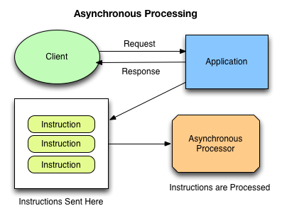

Discussions
===========

Although `Celery`_ is the most used solution to execute
`distributed asynchronous tasks in python`_ and django-channels_ is the new hype,
this project offers a solution based on `uWSGI spooler`_,
which requires no additional components, is particularly easy to setup,
and has a `straight learning curve`_.

.. _Django management tasks: https://docs.djangoproject.com/en/2.1/howto/custom-management-commands/
.. _Celery: http://www.celeryproject.org/
.. _distributed asynchronous tasks in python: https://realpython.com/asynchronous-tasks-with-django-and-celery/
.. _django-channels: https://blog.heroku.com/in_deep_with_django_channels_the_future_of_real_time_apps_in_django
.. _straight learning curve: https://blog.selectel.com/uwsgi-spooler/
.. _uWSGI spooler: https://uwsgi-docs.readthedocs.io/en/latest/Spooler.html?highlight=spooler

.. _uwsgi-server:

Pre-requisites
--------------
uWSGI is normally used ad an application server, to accept requests, transfer control to the python
web application using the wsgi protocol, and send the response back.

If configured as shown in this documentation, it can spawn some processes to handle asynchronous
tasks, reading the queue from a specified *spool* directory.

The following snippet of code starts a uWSGI server able to process both
HTTP requests and asynchronous tasks [#uwsgiproduction]_:

.. code-block:: bash

    uwsgi --check-static=./static --http=:8000 --master \
      --module=wsgi --callable=application \
      --pythonpath=./ \
      --processes=4 --spooler=./uwsgi-spooler --spooler-processes=2

- 4 processes will accept HTTP requests and send HTTP responses;
- 2 processes will check the spooler and execute tasks there;
- 1 master process will superintend all other processes.
- the ``./uwsgi-spooler`` path is the physical location on disk
  where the spooled tasks will be kept

.. rubric:: Footnotes
.. [#uwsgiproduction] Setting up uWSGI in production usually involves some sort of frontend proxy,
    but this is not the place to discuss it.
