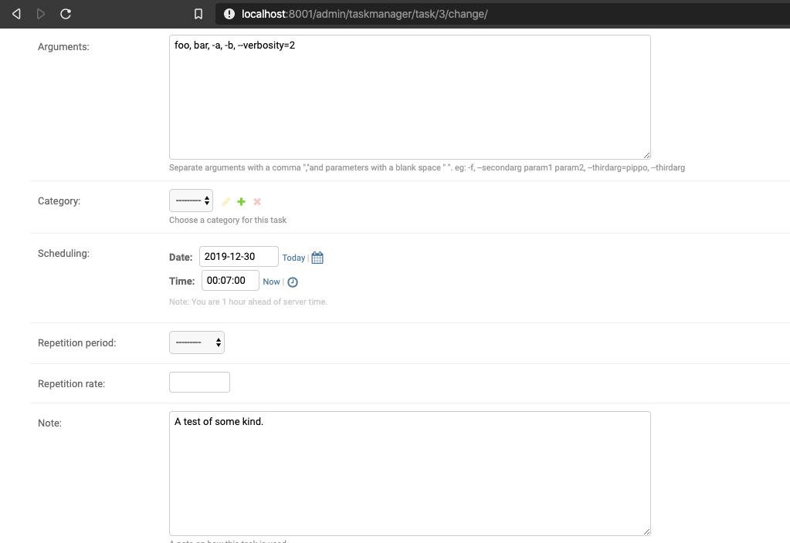
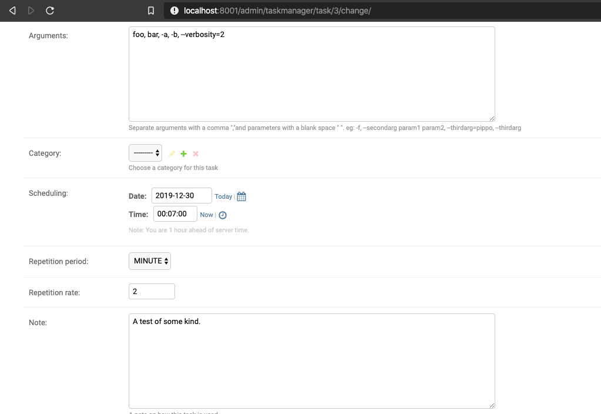
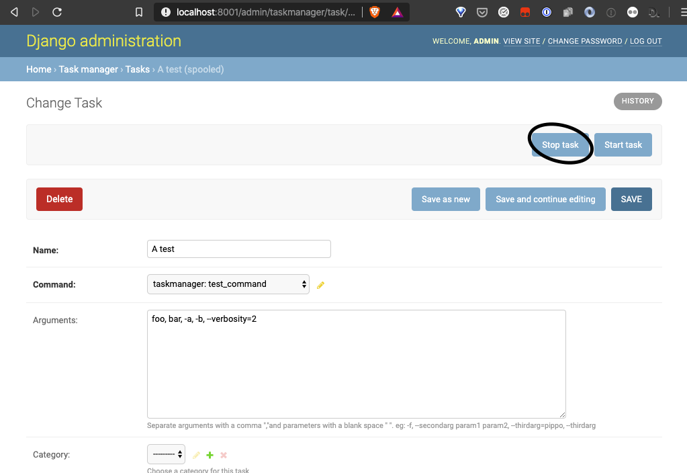

Get started
============

Following the demo tutorial, it will be possible to install, configure and use **django-uwsgi-taskmanager** for a
simple demo django project and have an idea of its basic workings.

Further knowledge can be found in the :ref:`howto-guides`.

The demo tutorial
-----------------

Clone the project from github onto your hard disk:

.. code-block:: bash

    git clone https://github.com/openpolis/django-uwsgi-taskmanager
    cd django-uwsgi-taskmanager

There is a basic Django project under the ``demo`` directory, with a ``uwsgi.ini`` file and four directories
(``media``, ``spooler``, ``static``, ``venv``).

.. code-block::

    demo/
    ├── demo/
    │   ├── __init__.py
    │   ├── settings.py
    │   ├── urls.py
    │   └── wsgi.py
    ├── manage.py
    ├── media/
    ├── spooler/
    ├── static/
    ├── uwsgi.ini
    └── venv/

Modify the content of ``uwsgi.ini``, if needed, for example by changing the port, if already in use,
and adding the number of processes.

Following is the content of my file, while writing this tutorial:

.. code-block:: ini

    [uwsgi]
    chdir = %d
    env = DJANGO_SETTINGS_MODULE=demo.settings
    http-socket = :8000
    master = true
    module = demo.wsgi
    plugin = python3
    pythonpath = %d
    processes = 2
    spooler-processes = 1
    spooler = %dspooler
    static-map = /static/=%dstatic
    virtualenv = %dvenv

.. note::

    Remember not to use this configuration in production, as it lets uWSGI handle all http connections, even for
    static content. Usually a frontend server, and/or CDN connections are used along the uWSGI app server.

Installation
^^^^^^^^^^^^

Enter the ``demo`` directory, then create and activate the virtual environments:

.. code-block:: bash

    $ cd demo
    $ mkdir -p venv
    $ python3 -m venv venv
    $ source venv/bin/activate

Install Django uWSGI taskmanager:

.. code-block:: bash

    (venv) $ pip install django-uwsgi-taskmanager

Install uWSGI (if you use the uWSGI binary from your OS, you can skip this step):

.. code-block:: bash

    (venv) $ pip install uwsgi

Collect all static files:

.. code-block:: bash

    (venv) $ python manage.py collectstatic

Create all the tables:

.. code-block:: bash

    (venv) $ python manage.py migrate

Collect all commands [#excludecore]_:

.. code-block:: bash

    (venv) $ python manage.py collectcommands --excludecore

Create a super user to login to the admin interface:

.. code-block:: bash

    (venv) $ python manage.py createsuperuser

Start the project with uWSGI:

.. code-block:: bash

    (venv) $ uwsgi --ini uwsgi.ini

Usage
^^^^^

Visit http://127.0.0.1:8000/admin/ [#uwsgi_port]_ and login with the credentials set in the ``createsuperuser`` task.

Add and launch a task
+++++++++++++++++++++

Proceed as indicated in the video, to create a test task and launch it.

Please note that the video refers to an older release and the UI interface may have changes slightly.
The sense of the operations still are perfectly valid.

.. embed:: https://vimeo.com/382021592
  :max_width: 700

Follow task execution in the lov-viewer window
++++++++++++++++++++++++++++++++++++++++++++++
From version 2.2.0, after the task has been launched, the link to log messages brings to the ``log-viewer``
windows, where log messages can be seen, updating in almost-real-time, and filtered or searched.

The following video shows a sample, using the ``test_livelogging_command`` task that generates info, debug, warnings and errors messages.

.. embed:: https://vimeo.com/433933483
  :max_width: 700

Scheduling
++++++++++
To **schedule** a task and have it starts at a given time, use the **Scheduling** fields:

Periodicity
+++++++++++
To have a task run **repeatedly**, set both the sheduling fields to a date in the future and
the **Repetition rate** and **Repetition period** fields to the desired quantities.

.. note::

    Please observe the following events in order to verify that the tasks are executed (refresh the page):

    - the **Last datetime** and **Next** read only fields change in time
    - new reports are generated and shown in the Reposts section (only the last five are kept)
    - the `uwsgi` task logs in the console show the scheduler executing the process at the right moments

Stop
++++
Finally, to stop a running task, press the **Stop task** button and check that the executions stop.

.. rubric:: Footnotes
.. [#excludecore] `excludecore` ensures that core django tasks are not fetched.
.. [#uwsgi_port] use the port specified in ``uwsgi.ini`` (defaults to 8000).

